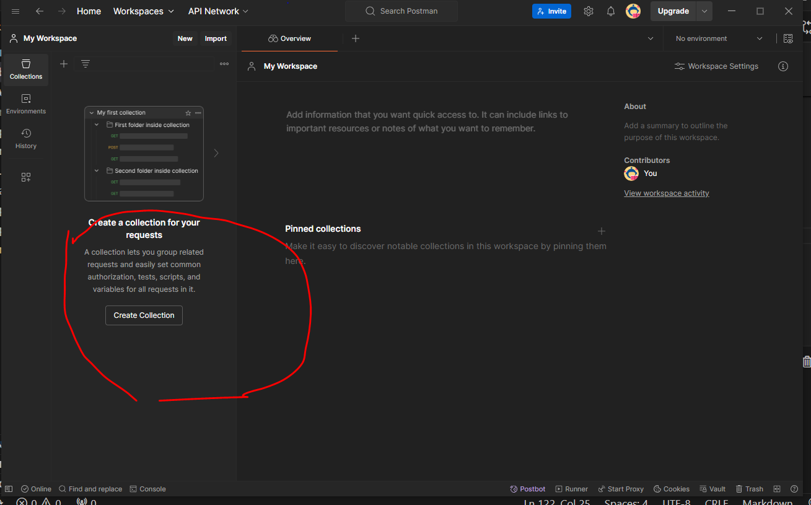
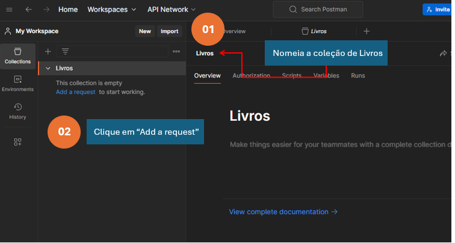
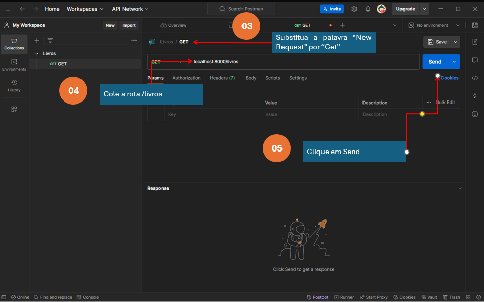
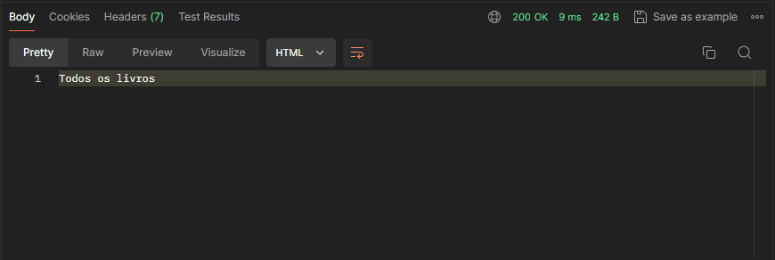
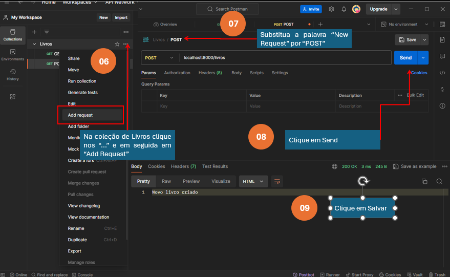
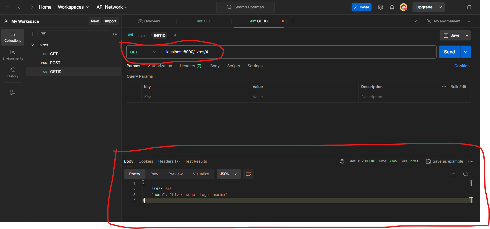
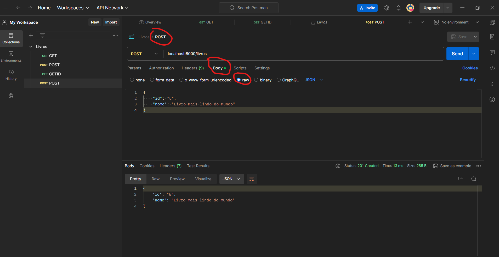
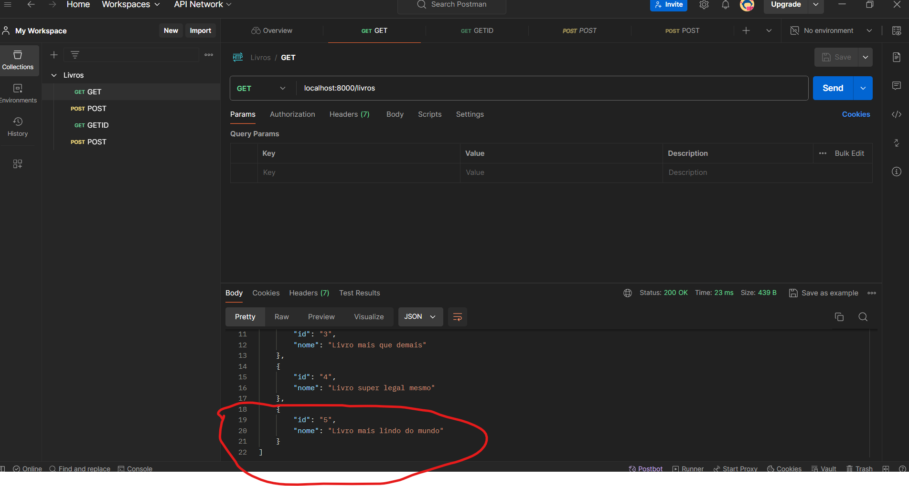
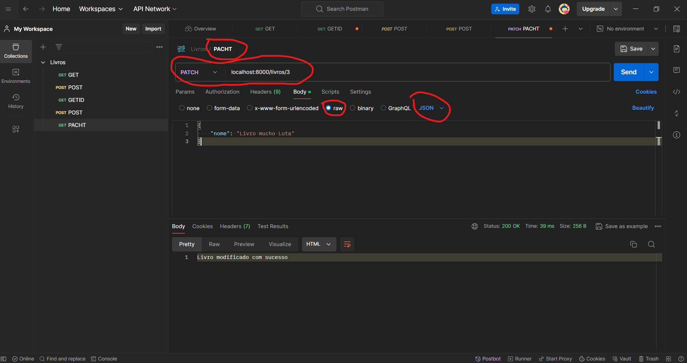
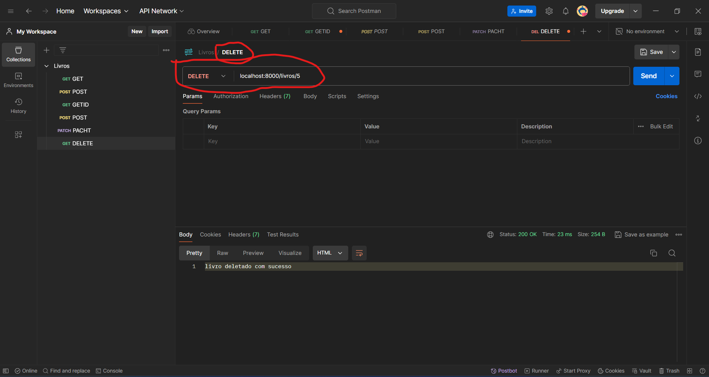

# Criando primeiro projeto em Node.js com ES6

## Criando a pasta e acessando pelo Visual Studio Code
01) Criar uma pasta chamada **alfala-books**, ou outro nome que achar conveniente para seu projeto.

## Criando a aplicação pelo terminal
02) Quando o terminal aparecer na parte inferior da sua IDE, escreva nele o comando: 
```bash
npm init.
```

## Fazendo seu Olá mundo
03) No mesmo terminal do passo anterior, rode o comando: 
npm install express para instalar o Express que irá nos auxiliar na criação da nossa API.
04) Criar um arquivo chamado app.js na pasta raiz do projeto.
05) No arquivo criado, escreva o seguinte código.
```
import express from 'express';
const app = express()
const port = 8000

app.get('/', (req, res) => {
  res.send('Olá mundo da leitura!')
})

app.listen(port, () => {
  console.log(`Escutando a porta ${port}`)
})
```
Rodando sua aplicação
06) Pelo terminal rodar o comando node app.js
07) Pelo seu navegador de internet acessar o link http://localhost:8000

## Instalando o Nodemon 

08) Pelo terminal rodar o comando npm install nodemon 
09) No package.json acrescente 
```
, 
    "start": "nodemon app.js localhost 8000"
    "type": "module",
```
10) Pelo terminal rodar o comando npm start

## Entendo o conceito de API 

__API__ - Uma API (Application Programming Interface) é uma interface que define as formas pelas quais um software se comunica e interage com outros softwares. Em outras palavras, uma API é um conjunto de regras e protocolos que permitem que diferentes aplicações se comuniquem e troquem dados entre si.

Algumas características-chave das APIs:

- __Padronização__: As APIs fornecem um conjunto padronizado de regras e formatos que devem ser seguidos para que a comunicação entre diferentes sistemas ocorra de maneira bem-sucedida.

- __Abstração__: As APIs escondem a complexidade dos sistemas subjacentes, permitindo que os desenvolvedores interajam com eles de uma maneira simples e intuitiva.

- __Reutilização__: As APIs possibilitam a reutilização de funcionalidades já existentes em outros sistemas, evitando a necessidade de reinventar a roda.

- __Interoperabilidade__: As APIs permitem que aplicações diferentes, desenvolvidas em plataformas e linguagens distintas, se comuniquem e troquem informações.

Exemplos comuns de APIs incluem as APIs de redes sociais (como a API do Twitter), APIs de mapas (como a API do Google Maps) e APIs de pagamento (como a API do PayPal). Essas APIs permitem que outros aplicativos e serviços se integrem e utilizem suas funcionalidades.

## Entendo de rotas

**Rotas**, no contexto de uma API, são os caminhos ou endpoints que definem como os clientes (aplicações que consomem a API) podem acessar e interagir com os recursos disponibilizados pela API.

As rotas são normalmente definidas usando um padrão de URL (Uniform Resource Locator) que segue uma estrutura específica, como:

- http://api.exemplo.com/v1/users 
- http://api.exemplo.com/v1/products
- http://api.exemplo.com/v1/orders

##  Instalando o postman
Iremos usar esta ferramenta para fazer nossas requisições de teste na nossa API

11) Entrar no site do postman; https://www.postman.com/
12) Baixar a versão para seu respectivo sistema operacional;
13) Abrir o app instalado e clicar no botão "Skip and go to the APP".

##  Criando primeira de rota
14) Criar uma pasta chamada **"routes"** dentro do projeto;
15) Dentro da pasta criada, crie um arquivo: **"livro.js"** para criarmos nosso código;
16) Dentro desse arquivo iremos criar e exportar o Router:
````
import express from 'express';
const router = express.Router();

````
17) Depois iremos criar as rotas propriamente ditas:
```
import { Router } from 'express';
const router = Router();

// Rota GET para a raiz do recurso "livros"
router.get('/', (req, res) => {
  // Retorna a mensagem "Alfalá Rota Get"
  res.send('Alfalá Rota Get');
});

// Rota POST para a raiz do recurso "livros"
router.post('/', (req, res) => {
  // Retorna a mensagem "Você fez uma requisição do tipo POST"
    res.send('Você fez uma requisição do tipo POST');
});

// Rota PATCH para a raiz do recurso "livros"
router.patch('/', (req, res) => {
  // Retorna a mensagem "Você fez uma requisição do tipo PATCH"
    res.send('Você fez uma requisição do tipo PATCH');
});

// Rota DELETE para a raiz do recurso "livros"
router.delete('/', (req, res) => {
  // Retorna a mensagem "Você fez uma requisição do tipo DELETE"
    res.send('Você fez uma requisição do tipo DELETE');
});


export default router;


export default router;
```

18) Abra o Postman de cliqe em  **Create Colletion** : 



19) Nomei a coleção de   **Livros** e  clique em **"Add request"**



20) Substitua a palavra **“New Request”** por **“Get”**  Cole a rota **"localhost:8000/livros"**  e em seguinda clique em **Send**



21) Note que que no corpo da requição retornou :



```
**livroRoutes.js***

// Obter todos os livros
router.get('/', (req, res) => {
  // Lógica para buscar todos os livros
  res.send('Todos os livros');
});

```
22) Clique em **Save** para salvar 

23) Explique sobre o status http 

# Códigos de Status HTTP

Os **códigos de status HTTP** são um conjunto padronizado de números que indicam o resultado de uma requisição feita por um cliente (como um navegador) a um servidor web.

Esses códigos estão divididos em 5 principais categorias:

### 1. Respostas Informativas (1xx)
Esses códigos indicam que a requisição foi recebida pelo servidor e está sendo processada. Eles informam ao cliente que a requisição está em andamento, mas ainda não foi concluída. Exemplos:
- `100 Continue`: O servidor recebeu os cabeçalhos da requisição e o cliente pode enviar o corpo da mensagem.
- `101 Switching Protocols`: O servidor está trocando os protocolos, como de HTTP para WebSocket.

### 2. Respostas de Sucesso (2xx)
Esses códigos indicam que a requisição do cliente foi recebida, compreendida e processada com sucesso pelo servidor. Exemplos:
- `200 OK`: A requisição foi bem-sucedida.
- `201 Created`: O recurso foi criado com sucesso.
- `204 No Content`: A requisição foi bem-sucedida, mas não há conteúdo para retornar.

### 3. Respostas de Redirecionamento (3xx)
Esses códigos indicam que uma ação adicional é necessária para que o cliente conclua a requisição. Geralmente, isso envolve um redirecionamento para outro URL. Exemplos:
- `301 Moved Permanently`: O recurso solicitado foi movido permanentemente para um novo URL.
- `302 Found`: O recurso solicitado foi encontrado em um URL diferente, mas o redirecionamento é temporário.
- `304 Not Modified`: O recurso não foi modificado desde a última requisição, portanto, o cliente pode usar o cache.

### 4. Respostas de Erro do Cliente (4xx)
Esses códigos indicam que houve um erro do lado do cliente na requisição. Isso significa que o cliente fez uma requisição inválida ou não autorizada. Exemplos:
- `400 Bad Request`: A requisição do cliente estava mal formada ou inválida.
- `401 Unauthorized`: O cliente não está autenticado ou não possui permissão para acessar o recurso.
- `404 Not Found`: O recurso solicitado não foi encontrado no servidor.

### 5. Respostas de Erro do Servidor (5xx)
Esses códigos indicam que houve um erro do lado do servidor ao processar a requisição válida do cliente. Exemplos:
- `500 Internal Server Error`: Ocorreu um erro inesperado no servidor.
- `501 Not Implemented`: O servidor não suporta a funcionalidade necessária para atender a requisição.
- `503 Service Unavailable`: O servidor está temporariamente indisponível, talvez por sobrecarga ou manutenção.

Esses códigos de status HTTP são essenciais para a comunicação entre clientes (como navegadores) e servidores web, permitindo que ambos entendam o resultado de uma requisição e tomem as ações apropriadas.

Acesse https://httpstatusdogs.com/

24) Na coleção de Livros aproxime o ponteiro do mouse até surgir **...**  em seguida clique em **Add Request**. Substitua a palavras "New Request" para **"POST"** e abra a caixa e seleção e também substitua para **Post**. Cole a URL **http://localhost:8000** e clique em **Send** . Noe que no corpo da requisição aparareceu o trecho .. res.send('Novo livro criado'); . 



25) Podemos utilizar o bloco try catch  para deixar mais específico o retorno da rota. Em  routes | livroRoutes.js ajuste a rota get para : 


```

router.get('/', (req, res) => {
    try {
        throw new Error("Ocorreu um erro no banco de dados")
        res.send('Rota Get Acessada')
    } catch (error) {
        res.status(500)
        res.send(error.message)
    }
})
```

### Aprendendo sobre a arquitetura MVC

A arquitetura MVC (Model-View-Controller) é um padrão de design muito utilizado no desenvolvimento de aplicações web e móveis. Ela divide a aplicação em três componentes principais:

**Model:** Responsável pela lógica de negócio e manipulação de dados. O model contém as regras de negócio, acesso a banco de dados, validações, etc.

**View:** Responsável pela interface do usuário, ou seja, a apresentação visual da aplicação. A view é encarregada de renderizar os dados recebidos do controller e exibi-los para o usuário.

**Controller:** Atua como intermediário entre o model e a view. O controller recebe as requisições do usuário, processa as informações, interage com o model e envia os dados para a view.

No contexto do curso de Node.js, os controladores que você mencionou fazem parte dessa arquitetura MVC. Eles são responsáveis por receber as requisições, processar a lógica de negócio (que normalmente ficaria no model) e enviar a resposta adequada para a view (que neste caso seria a própria resposta HTTP).

Essa separação de responsabilidades traz diversos benefícios, como:


- **Modularidade:** Cada componente (model, view, controller) pode ser desenvolvido e testado de forma independente.
- **Reusabilidade:** Os componentes podem ser reutilizados em outras partes da aplicação.
- **Manutenibilidade:** Alterações em um componente não afetam os demais, facilitando a manutenção do código.
- **Escalabilidade:** A aplicação pode ser escalada de forma mais eficiente, pois cada componente pode ser tratado de forma independente.


25) Na raiz do projeto crie um pasta ***Controllers***  e crie um arquivo chamado ***livroController.js***  e digite

```
export const getLivros = (req, res) => {
    try {
        res.send('Lista de livros');
    } catch (error) {
        res.status(500);
        res.send(error.message);
    }
};
```

26) Retorno em ***LivroRoutes.js**  
  - Ajuste a função para router.get('/', getLivros);
  - import import {getLivros} from '../Controllers/livroController.js';

  
  `Controllers | livroController.js`

  ```
  export const getLivros = (req, res) => {
    try {
        res.send('Lista de livros');
    } catch (error) {
        res.status(500);
        res.send(error.message);
    }
  };
  ```

`Routes | livroRoutes.js`


    ```
    import {getLivros} from '../Controllers/livroController.js';
    import { Router } from 'express';
    const router = Router();

    // Rota GET para a raiz do recurso "livros"
    router.get('/', getLivros);

    ```

Teste a rota no Postman  e veja que nada mundo

27) lendo mais sobre

https://www.alura.com.br/artigos/http#:~:text=HTTP%20%C3%A9%20um%20protocolo%2C%20uma,nome%20Hyper%20Text%20Transport%20Protcolo


https://www.youtube.com/watch?time_continue=547&v=kDy62zaCHZE&embeds_referring_euri=https%3A%2F%2Fwww.alura.com.br%2F&source_ve_path=Mjg2NjY&feature=emb_logo&themeRefresh=1


28) No mesmo nível do arquivo app.js, criaremos um novo chamado **livros.json** que servirá como database. Já fizemos um rascunho no formato JSON: 


`livros.json`

```livro.json
[
    {
        "id": "1",
        "nome": "Livro irado"
    },
    {
        "id": "2",
        "nome": "Livro muito legal"
    },
    {
        "id": "3",
        "nome": "Livro mais que demais"
    }
]
```

29) para entendermos como funciona a biblioteca File System vamos
  - CTRL + C para parar o servido no terminal
  - Na raiz do projeto crie um arquivo `teste.js` e digite: 

```teste.js 
import fs from 'fs';
console.log(fs.readFileSync("livros.json"));
``` 

No terminal rode o comando

```bash
 node teste.js
``` 

- NOTE: que apareceu um buffer pois o terminal lê um arquivo e não converte a leitura. Em **teste.js** ajuste inserindo JSON.parse


```teste.js
import fs from 'fs';
console.log(JSON.parse(fs.readFileSync("livros.json")));

```
No Terminal execute novamente

```bash
 node teste.js
``` 

Vamos agora passar um novo dado dentro do arquivo `teste.js` digite


```teste.js
import fs from 'fs';
const dadosAtuais = JSON.parse(fs.readFileSync("livros.json"));
const novoDado = { id:'4', nome: 'Livro super legal mesmo' };
fs.writeFileSync("livros.json", JSON.stringify([...dadosAtuais, novoDado ]));
console.log(JSON.parse(fs.readFileSync("livros.json")));
```

**ENTENDEDO ESSE TRECHO DE CÓDIGO**

import fs from 'fs';
Import o módulo fs (File System) do Node.js.

const dadosAtuais = JSON.parse(fs.readFileSync("livros.json"));
Lê o conteúdo do arquivo livros.json e converte-o de JSON para um objeto JavaScript.

const novoDado = { id:'4', nome: 'Livro super legal mesmo' };
Cria um novo objeto JavaScript representando um novo livro.

fs.writeFileSync("livros.json", JSON.stringify([...dadosAtuais, novoDado ]));
Adiciona o novo livro aos dados atuais, converte o array resultante para JSON e escreve no arquivo livros.json.

console.log(JSON.parse(fs.readFileSync("livros.json")));
Lê novamente o conteúdo do arquivo livros.json, converte-o de JSON para um objeto JavaScript e 
imprime no console.

Em resumo, esse trecho de código lê um arquivo JSON, adiciona um novo item a ele, escreve o arquivo atualizado e, por fim, imprime o conteúdo do arquivo atualizado no console.

30) Vamos simular que o livros.json será o retorno do nosso banco de dados, então: 
    - Retorne no arquivo  `livroController.js` e ajuste: 


```livroController.js
  import fs from 'fs'

  export const getLivros = (req, res) => {
    try {
        const livros = JSON.parse(fs.readFileSync("livros.json"))
        res.send(livros);
    } catch (error) {
        res.status(500);
        res.send(error.message);
    }
  };
  
 ```

 Note que no código acima os controladores estão  atuando com responsabilidade além da respondabilidade da rota:  A separação de responsabilidades entre controladores e serviços é importante para manter o código organizado e de fácil manutenção. Veja:

>Os *controladores* são responsáveis por receber as requisições HTTP, processar os dados de entrada e enviar as respostas.
>
>Porém, eles não devem ficar responsáveis por *tarefas como conexão com banco de dados, leitura/escrita de arquivos, chamadas a APIs externas, etc.* Essas responsabilidades devem ficar em **serviços** separados.

  - Crie uma pasta chamada `Services` e um arquivo chamado `livroServices.js` Digite: 

  ```livroServices.js
  
import fs from 'fs'

function getTodosLivros() {
    return JSON.parse(fs.readFileSync("livros.json"))    
}

export {getTodosLivros};
  ```

 - Retorne em `livroController.js`  e ajuste: 

 ```livroController.js
import {getTodosLivros} from '../Services/livroServices.js';

export const getLivros = (req, res) => {
    try {
        const livros = getTodosLivros()
        res.send(livros);
    } catch (error) {
        res.status(500);
        res.send(error.message);
    }
};
 ```
No exemplo da aula, o controlador "getLivros" não deveria ficar responsável por ler o arquivo "livros.json" e retornar os dados. Essa tarefa foi transferida para o serviço "getTodosLivros".

Dessa forma, o controlador fica mais enxuto, com apenas a lógica de processamento da requisição. E o serviço fica responsável por toda a lógica de acesso aos dados, tornando o código mais organizado e de fácil manutenção.


31) Vamos escrevar agora uma lógica para retornar apenas um livro específico da nossa busca. Vamos filtar o livro pelo ID do livro. 

- Em `livroServices.js` adione a function getLivroPorId(id)

```livroServices.js
import fs from 'fs'
function getTodosLivros() {
    return JSON.parse(fs.readFileSync("livros.json"))    
}
function getLivroPorId(id) {
    const livros = JSON.parse(fs.readFileSync("livros.json"))
    const livroFiltrado = livros.filter( livro => livro.id === id )[0]
    return livroFiltrado
}
export {getTodosLivros, getLivroPorId}; 

```


- Vamos chamar a function getLivroPorId(id) em `livroController.js`  dentro da const getLivro

```livroController.js

import {getTodosLivros, getLivroPorId} from '../Services/livroServices.js';

export const getLivros = (req, res) => {
    try {
        const livros = getTodosLivros()
        res.send(livros);
    } catch (error) {
        res.status(500);
        res.send(error.message);
    }
};

export const getLivro = (req, res) => {
    try {
        const id = req.params.id
        const livro = getLivroPorId(id)
        res.send(livro)
        } catch (error) {
        res.status(500)
        res.send(error.message)
    }
};
```

- Em `livroRouters.js`  crie a rota que chamará o livro por Id -  router.get('/:id', getLivroPorId);

```livroRouters.js
import {getLivros, getLivro} from '../Controllers/livroController.js';
import { Router } from 'express';
const router = Router();

router.get('/', getLivros);
router.get('/:id', getLivro);
```

- Teste no postman




32) Agora vamos permitir que a nossa aplicação receba novos livros que serão cadastrados via postman e guardados no arquivo `livro.json` . Para isso:

  - Em `app.js` insira app.use(express.json()) 

  ```app.js
import express from 'express';
import routerLivro from './Routes/livroRoutes.js'

const app = express();
app.use(express.json())

const port = 8000;
// Código omitido
```

- Em `livroServices.js`  vamos inserir uma function que  insere o livro no arquivo livro.js

```livroServices.js

import fs from 'fs'

function getTodosLivros() {
  // Código omitido
}

function getLivroPorId(id) {
    // Código omitido
}

function  insereLivro(livroNovo) {
    const livros = JSON.parse(fs.readFileSync("livros.json"));
    const novaListaDeLivros = [...livros, livroNovo];
    fs.writeFileSync("livros.json", JSON.stringify(novaListaDeLivros));
  };

export {getTodosLivros, getLivroPorId, insereLivro}; 
```

- Em `livroController.js` insira o código e ajuste no import


```livroController.js

import {getTodosLivros, getLivroPorId, insereLivro} from '../Services/livroServices.js';

export const getLivros = (req, res) => {
    // Código omitido
};

export const getLivro = (req, res) => {
    // Código omitido
};

export const postLivro = async (req, res) => {
    try {
      const livroNovo = req.body;
      await insereLivro(livroNovo);
      res.status(201).json(livroNovo);
    } catch (error) {
      res.status(500).send(error.message);
    }
  };
```

- Em `livroRoutes.js` adione a rota criadada de postLivro

```livroRoutes.js
import {getLivros, getLivro, postLivro} from '../Controllers/livroController.js';
import { Router } from 'express';
const router = Router();

router.post("/", postLivro);
router.get('/:id', getLivro);
router.get('/', getLivros);


export default router;

```

- No postman  teste o post digitando o seguinte texto

```
{
    "id": "5",
    "nome": "Livro mais lindo do mundo"
}
```




- Note que ao testar novamente a rota ou abrir o arquivo .json o item foi inserido:




33) Precisamos permitir que nosssa aplicação consiga realização atualização de valores. 

Em `livroServices.js` insira a function  modificaLivro

```livroServices.js

import fs from 'fs'

function getTodosLivros() {
    // Código omitido   
}

function getLivroPorId(id) {
    // Código omitido
}

function  insereLivro(livroNovo) {
    // Código omitido
  };

  function  modificaLivro (modificacoes, id) {
    let livrosAtuais = JSON.parse(fs.readFileSync("livros.json"));
    const indiceModificado = livrosAtuais.findIndex(livro => livro.id === id);
    const conteudoMudado = { ...livrosAtuais[indiceModificado], ...modificacoes };
    livrosAtuais[indiceModificado] = conteudoMudado;
    fs.writeFileSync("livros.json", JSON.stringify(livrosAtuais));
  };

export {getTodosLivros, getLivroPorId, insereLivro, modificaLivro}; 

```

Em `livroController,js` adione a const patchLivro

```LivroController,js

import { getTodosLivros, getLivroPorId, insereLivro, modificaLivro } from '../Services/livroServices.js';

export const getLivros = (req, res) => {
// Código omitido
};

export const getLivro = (req, res) => {
// Código omitido
};

export const postLivro = async (req, res) => {
// Código omitido
};

export const patchLivro = async (req, res) => {
    try {
        const id = req.params.id
        const body = req.body
        modificaLivro(body, id)
        res.send( "Livro modificado com sucesso");
    } catch (error) {
        res.status(500)
        res.send(error.message)
    }
};

```

Atualize as rotas em `livroRoutes.js`

```livroRoutes.js 
import {getLivros, getLivro, postLivro, patchLivro} from '../Controllers/livroController.js';
import { Router } from 'express';
const router = Router();

router.patch("/:id", patchLivro);
router.post("/", postLivro);
router.get('/:id', getLivro);
router.get('/', getLivros);

export default router;

``` 

No postaman teste a rota passando no corpo da requisição

```
{
    "nome": "Livro mucho Luta"
}
```




34) Agora vamos a funcionalidade de deletar


Em `livroServices.js` insira a function  modificaLivro

```livroServices.js

import fs from 'fs'

function getTodosLivros() {
    // Código omitido   
}

function getLivroPorId(id) {
    // Código omitido
}

function  insereLivro(livroNovo) {
    // Código omitido
  };

  function  modificaLivro (modificacoes, id) {
    // Código omitido
  };

  function deletaLivroPorId(id) {
    const livros = JSON.parse(fs.readFileSync("livros.json"))
    const livrosFiltrados = livros.filter(livro => livro.id !== id)
    fs.writeFileSync("livros.json", JSON.stringify(livrosFiltrados))

}
export { getTodosLivros, getLivroPorId, insereLivro, modificaLivro, deletaLivroPorId }; 

```

Em `livroController,js` adione a const patchLivro

```LivroController,js

import { getTodosLivros, getLivroPorId, insereLivro, modificaLivro } from '../Services/livroServices.js';

export const getLivros = (req, res) => {
// Código omitido
};

export const getLivro = (req, res) => {
// Código omitido
};

export const postLivro = async (req, res) => {
// Código omitido
};

export const patchLivro = async (req, res) => {
// Código omitido
};

export const deletaLivro = (req, res) => {
    try {
        const id = req.params.id
        deletaLivroPorId(id)
        res.send("livro deletado com sucesso")
    } catch (error) {
        res.status(500)
        res.send(error.message)
    }
};


```

Atualize as rotas em `livroRoutes.js`

```livroRoutes.js 
import {getLivros, getLivro, postLivro, patchLivro, deletaLivro} from '../Controllers/livroController.js';
import { Router } from 'express';
const router = Router();

router.delete("/:id", deletaLivro)
router.patch("/:id", patchLivro);
router.post("/", postLivro);
router.get('/:id', getLivro);
router.get('/', getLivros);

export default router;


``` 

No postman vamos deletar o valor 5 





35) ### Refinando a API
Caso o id não seja um número válido, o ideal é retornar um status `422 (Unprocessable Entity)` e uma mensagem de "Id inválido". Isso garante que nossa aplicação esteja preparada para lidar com possíveis erros e tenha uma resposta consistente para essas situações.

A ideia é que, mesmo que o usuário envie uma requisição com um identificador inválido (como "batata" ao invés de um número), a API irá retornar uma resposta informando que o id é inválido, em vez de simplesmente não retornar nada.

Essa verificação é importante para tornar a aplicação mais resiliente e fornecer uma experiência melhor para os usuários, evitando que eles fiquem confusos com respostas inesperadas.


- Em `livroController.js` vamos ajustar para: - Inclui if e else para verificação

```livroController.js
import { getTodosLivros, getLivroPorId, insereLivro, modificaLivro,deletaLivroPorId } from '../Services/livroServices.js';

export const getLivros = (req, res) => {
// Código omitido
};

export const getLivro = (req, res) => {
    try {
        const id = req.params.id
        //Trecho ajustado
        if(id && Number(id)) {
            const livro = getLivroPorId(id)
            res.send(livro)
        } else {
            res.status(422)
            res.send("Id inválido")
        }
 
    } catch (error) {
        res.status(500)
        res.send(error.message)
    }
};

export const postLivro = async (req, res) => {
// Código omitido
};

export const patchLivro = async (req, res) => {
    try {
        const id = req.params.id
        //Trecho ajustado
        if(id && Number(id)) {
            const body = req.body
            modificaLivro(body, id)
            res.send("Item modificado com sucesso")
        } else {
            res.status(422)
            res.send("Id inválido")
        }
    } catch (error) {
        res.status(500)
        res.send(error.message)
    }
};

export const deletaLivro = (req, res) => {
    try {
        const id = req.params.id
        //Trecho ajustado
        if(id && Number(id)) {
            deletaLivroPorId(id)
            res.send("livro deletado com sucesso")
        } else {
            res.status(422)
            res.send("ID inválido")
        }
    } catch (error) {
        res.status(500)
        res.send(error.message)
    }
};

```

Seria também importante não permitir que o usuário insira via cadatre novos usuários apenas com id então podemos incluir em  `livroController.js` 

```livroController.js

import { getTodosLivros, getLivroPorId, insereLivro, modificaLivro,deletaLivroPorId } from '../Services/livroServices.js';

export const getLivros = (req, res) => {
// Código omitido
};

export const getLivro = (req, res) => {
// Código omitido
};

export const postLivro = (req, res) => {
// Código omitido
};

export const patchLivro = async (req, res) => {
// Código omitido
};

export const deletaLivro = (req, res) => {
    try {
        const id = req.params.id
        //Trecho ajustado
        if(id && Number(id)) {
            deletaLivroPorId(id)
            res.send("livro deletado com sucesso")
        } else {
            res.status(422)
            res.send("ID inválido")
        }
    } catch (error) {
        res.status(500)
        res.send(error.message)
    }
};

```

